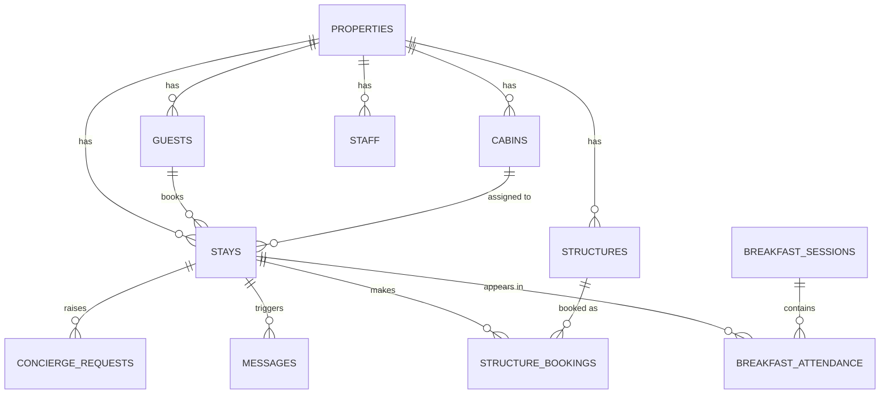

# Database

Postgres on Supabase. The **column-level source of truth** is the SQL in
[`../migrations/`](../migrations/) (indexed in [`migrations/README.md`](../migrations/README.md))
plus the matching interfaces in [`../src/types/aura.ts`](../src/types/aura.ts). This file is the
orientation layer: domains, the core relationships, and the gotchas.

## Conventions

- **Column casing is mixed.** Most tables use **camelCase** quoted identifiers
  (`"propertyId"`, `"checkIn"`, `"createdAt"`). The **Food & Beverage menu** tables (`fb_*`)
  and the **breakfast menu** use **snake_case** (`property_id`, `ala_carte`). Match the table
  you query — don't assume. (Note: `breakfast_sessions`/`breakfast_attendance` are camelCase;
  only the *menu* side is snake_case.)
- **Multi-tenant**: nearly every table has a `propertyId` (snake: `property_id`) and is scoped
  per property by **RLS**.
- **i18n**: translatable text is stored as `name` / `name_en` / `name_es` columns.
- **IDs** are UUID/text; timestamps are ISO strings.

## Row-Level Security (RLS)

Per-property isolation is enforced by RLS policies — baseline in
[`migrations/rls_all_properties.sql`](../migrations/rls_all_properties.sql), with
feature-specific policies in `*_rls.sql` (surveys, structure bookings). The browser/anon and
cookie clients respect RLS; `supabaseAdmin` (service role) **bypasses** it, so server code that
uses it must filter by `propertyId` explicitly (the crons do this).

## Core relationships (simplified)

> This is the reservation core only. Each domain below has its own tables; see the migrations.

## Domains & tables

**Core / reservations**
`properties`, `stays`, `guests`, `cabins`, `structures`, `structure_bookings`,
`structure_reviews`, `map_pois`, folio items. Entities: `Property`, `Stay`, `Guest`, `Cabin`,
`Structure`, `StructureBooking`, `MapPoi`, `FolioItem`.

**Housekeeping & maintenance**
`housekeeping_rules`, housekeeping tasks, `maintenance_rules`, `maintenance_tasks`. Entities:
`HousekeepingRule`, `HousekeepingTask`, `MaintenanceRule`, `MaintenanceTask`,
`ChecklistTemplate`. Rule engine in `src/lib/housekeeping-rule-engine.ts`.

**Food & Beverage** *(snake_case)*
`fb_*` (categories, menu items, ingredients, flavors), `fb_orders`, `fb_order_items`. Entities:
`FBCategory`, `FBMenuItem`, `FBOrder`, `FBOrderItem`, `FBSettings`.

**Breakfast salon**
`breakfast_sessions`, `breakfast_attendance`, tables/visitors. Entities: `BreakfastSession`,
`BreakfastAttendance`, `BreakfastTable`, `BreakfastVisitor`.

**Stock / procurement / assets** (see [[stock-module]])
`stock_categories`, `stock_locations`, `stock_products`, stock balances/`stock_movements`,
`stock_batches`, `stock_settings`, `suppliers`, `purchases` + items, `assets`,
`asset_depreciation_entries`, inventory counts. Entities: `StockProduct`, `StockMovement`,
`StockBatch`, `Supplier`, `Purchase`, `Asset`, `InventoryCount`.

**Concierge**
`concierge_groups`, `concierge_items`, `concierge_requests` (+ stock components). Entities:
`ConciergeGroup`, `ConciergeItem`, `ConciergeRequest`.

**Surveys & reviews**
survey templates/`survey_responses`, curated config, area reviews. Entities: `SurveyTemplate`,
`SurveyQuestion`, `SurveyResponse`, `SurveyCuratedConfig`, `StructureReview`.

**Messaging & automation**
`automation_rules`, `message_templates`, `messages` (the WhatsApp queue). Entities:
`AutomationRule`, `MessageTemplate`, `WhatsAppMessage`.

**Staff & scheduling**
`staff`, staff schedules / overrides / checkpoints, `staff_scraps` (+ reactions). Entities:
`Staff`, `StaffSchedule`, `StaffScheduleOverride`, `ScheduleConfig`, `ScheduleCheckpoint`.

**Events & weddings**
events, weddings (+ vendors, cabin assignments, installments). Entities: `Event`, `Wedding`,
`WeddingVendor`, `WeddingInstallment`.

**System**
`audit_logs` (all writes + cron runs), `changelogs` + `changelog_entries`, system bugs,
contacts. Entities: `AuditLog`, `Changelog`, `ChangelogEntry`, `SystemBug`, `Contact`.

## Adding a schema change

Add a new file to `migrations/`, apply it in the Supabase SQL Editor, add the matching
interface to `aura.ts`, and append the file to the migrations index. Don't edit already-applied
migration files.
